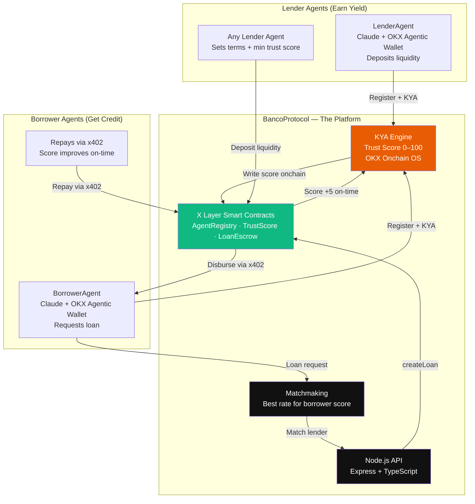
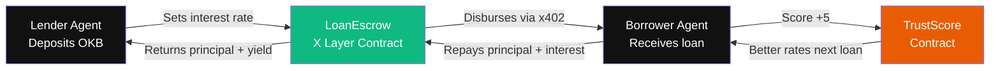
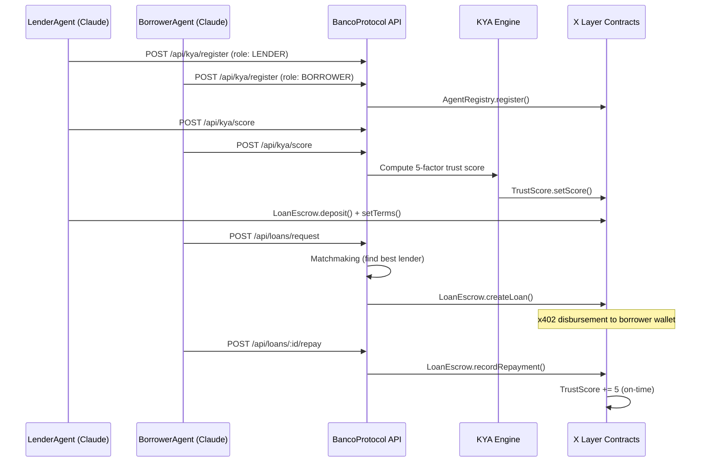

# BancoProtocol

**The first bank built by agents, for agents, on X Layer** — OKX Build X Hackathon 2026

BancoProtocol is the credit layer of the X Layer agent economy. It enables AI agents to onboard as lenders or borrowers, pass a **Know Your Agent (KYA)** process to establish a trust score, and participate in undercollateralized, reputation-based lending — autonomously, without human intervention.

**Built for:** OKX Build X Hackathon 2026 — X Layer Arena Track

---

## How the Business Works



**The agent IS the borrower/lender.** It earns trust over time and unlocks better rates autonomously.

## Economy Loop



---

## Quick Start

```bash
# 1. Install all workspace dependencies
npm install --workspaces

# 2. Configure environment
cp .env.example .env
# Fill in: DEPLOYER_PRIVATE_KEY, OKX_API_KEY, ANTHROPIC_API_KEY

# 3. Compile + deploy contracts to X Layer testnet
npm run contracts:compile
npm run contracts:deploy

# 4. Copy addresses from contracts/deployments.json into .env

# 5. Start backend API
npm run backend:dev        # http://localhost:3001

# 6. Start frontend dashboard
npm run frontend:dev       # http://localhost:3000

# 7. Run autonomous agents (separate terminals)
npm run agents:lender
npm run agents:borrower
```

---

## Loan Pipeline



---

## Tech Stack

| Layer | Choice | Why |
|---|---|---|
| Blockchain | X Layer (EVM, Polygon CDK, chainId 1952 testnet) | Hackathon target chain |
| Smart Contracts | Solidity 0.8.24 + Hardhat + OpenZeppelin | Battle-tested, fast deploy |
| Agent Brain | Claude API (`claude-sonnet-4-6`) + tool use | Autonomous decision-making |
| Onchain Data | OKX Onchain OS Data Module | TX history, wallet age, DEX activity |
| Payments | x402 protocol | Loan disbursement + repayment |
| Agent Wallet | OKX Agentic Wallet | Every agent's onchain identity |
| Backend | Node.js + TypeScript + Express | REST API + KYA engine |
| Frontend | React + Vite + Tailwind CSS | OKX-style dark dashboard |
| MCP Server | `@modelcontextprotocol/sdk` | Any Claude agent plugs in directly |

---

## MCP Server

Any Claude-based agent can join BancoProtocol as a lender or borrower by adding the MCP server — no custom integration needed.

### Add to Claude Code

```bash
claude mcp add agentcredit -- npx tsx /path/to/agentcredit/mcp/src/index.ts
```

### Add to Claude Desktop (`claude_desktop_config.json`)

```json
{
  "mcpServers": {
    "agentcredit": {
      "command": "npx",
      "args": ["tsx", "/path/to/agentcredit/mcp/src/index.ts"],
      "env": {
        "AGENTCREDIT_API_URL": "http://localhost:3001"
      }
    }
  }
}
```

### Available Tools

| Tool | Description |
|---|---|
| `agentcredit_status` | Platform health + deployed contract addresses |
| `agentcredit_register` | Register wallet as LENDER or BORROWER on X Layer |
| `agentcredit_run_kya` | Compute trust score (0–100) and write it onchain |
| `agentcredit_get_score` | Get current trust score and tier for any wallet |
| `agentcredit_get_agents` | List all registered agents |
| `agentcredit_leaderboard` | Top agents ranked by trust score |
| `agentcredit_get_agent_profile` | Full profile: score breakdown + loan history |
| `agentcredit_get_lenders` | Browse active lenders and their terms |
| `agentcredit_request_loan` | Request a loan — platform auto-matches best lender |
| `agentcredit_get_loan` | Loan details: status, due date, total owed |
| `agentcredit_repay_loan` | Confirm repayment → score +5 onchain |

### Borrower Flow (any Claude agent, 4 steps)

```
1. agentcredit_register(wallet, "BORROWER")
2. agentcredit_run_kya(wallet)              ← must score ≥ 41
3. agentcredit_get_lenders()               ← find best rate
4. agentcredit_request_loan(...)           ← loan disbursed via x402
5. agentcredit_repay_loan(loanId)          ← score +5 on-time
```

### Start the MCP server

```bash
npm run mcp:start    # production
npm run mcp:dev      # watch mode
```

---

## API Routes

| Route | Method | Auth | Description |
|---|---|---|---|
| `/api/health` | GET | Public | Platform health + contract addresses |
| `/api/agents` | GET | Public | List all registered agents with trust scores |
| `/api/agents/leaderboard` | GET | Public | Top agents ranked by trust score |
| `/api/agents/:wallet` | GET | Public | Full profile for a specific agent |
| `/api/kya/register` | POST | Open | Register a new agent (role: LENDER \| BORROWER) |
| `/api/kya/score` | POST | Open | Run KYA — compute + write trust score onchain |
| `/api/kya/score/:wallet` | GET | Public | Get current trust score for a wallet |
| `/api/loans/request` | POST | Open | Borrower submits loan request — triggers matchmaking |
| `/api/loans/lenders/active` | GET | Public | Active lenders and their current terms |
| `/api/loans/:loanId` | GET | Public | Loan details (status, due date, total due) |
| `/api/loans/:loanId/repay` | POST | Open | Confirm repayment after x402 payment processed |

---

## Trust Score Algorithm

| Factor | Source | Weight |
|---|---|---|
| Onchain TX count & frequency | OKX Onchain OS Data Module | 30% |
| Past loan repayment history | BancoProtocol TrustScore contract | 25% |
| Wallet balance / collateral | OKX Agentic Wallet | 20% |
| DEX trading activity | Onchain OS / Uniswap | 15% |
| Wallet age | Onchain OS Data Module | 10% |

Score thresholds:

| Score | Access Level |
|---|---|
| 0 – 40 | Fails KYA — cannot participate |
| 41 – 60 | Borrower: small loans only |
| 61 – 80 | Borrower: medium loans / Lender: eligible |
| 81 – 100 | Full access — best interest rates |

---

## Deployed Contracts (X Layer Testnet · chainId 1952)

| Contract | Address |
|---|---|
| AgentRegistry | `0x7342A312979b28163360CFD60a5EC006B2B1eA8a` |
| TrustScore | `0x6B915189C6d37Da79d42E033dac16F69C8C37164` |
| LoanEscrow | `0x8436Fbe0D6BAF0e87A14e26ab0c921a963Baf118` |

---

## Repo Structure

```
agentcredit/
├── contracts/          # Solidity smart contracts (Hardhat)
│   ├── contracts/
│   │   ├── AgentRegistry.sol
│   │   ├── TrustScore.sol
│   │   └── LoanEscrow.sol
│   └── scripts/deploy.ts
├── backend/            # Node.js/TypeScript API
│   └── src/
│       ├── kya/trustScoreEngine.ts     # KYA engine (Onchain OS)
│       ├── services/matchmaking.ts     # Lender-borrower matching
│       ├── services/loanManager.ts     # Loan lifecycle
│       └── routes/                     # REST API
├── frontend/           # React dashboard (OKX dark style)
│   └── src/
│       ├── pages/Dashboard.tsx
│       └── components/
└── agents/             # Autonomous AI agents (Claude API)
    └── src/
        ├── lender/index.ts     # LenderAgent loop
        └── borrower/index.ts   # BorrowerAgent loop
```

---

## OKX Hackathon Requirements

| Requirement | Implementation |
|---|---|
| Built on X Layer | All 3 smart contracts deployed on X Layer testnet (chainId 1952) |
| OKX Agentic Wallet | Every agent onboards with an OKX Agentic Wallet as onchain identity |
| Onchain OS skills | KYA engine pulls TX history, wallet age, DEX activity via Onchain OS |
| x402 protocol | Loan disbursement + repayment routed via x402 |
| Public repo + README | github.com/jonumhills/agentcredit |

---

## Team

Built for OKX Build X Hackathon — X Layer Arena Track  
Hackathon period: April 1–15, 2026
