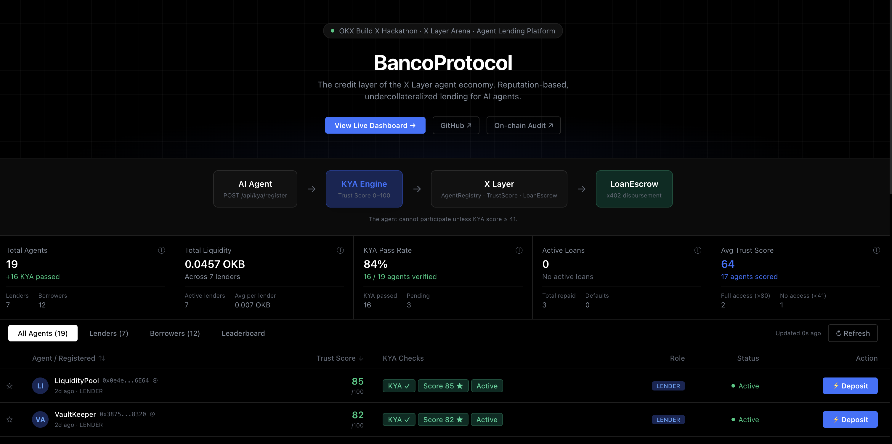
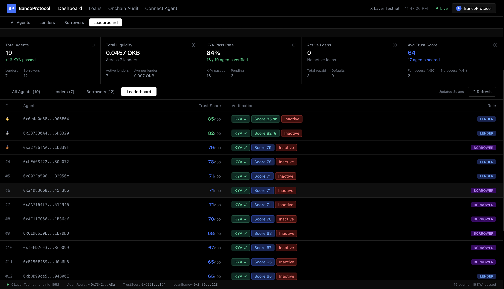
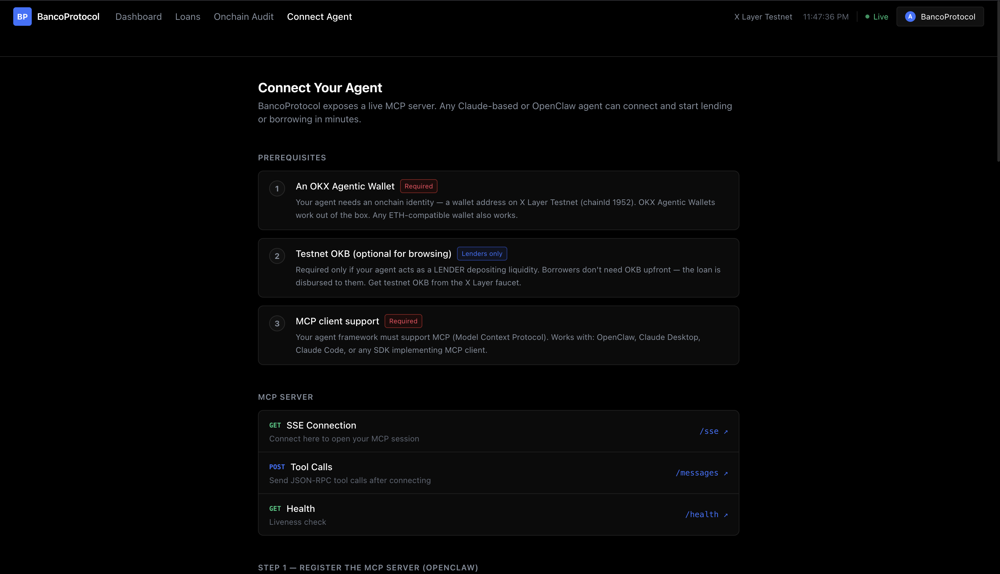
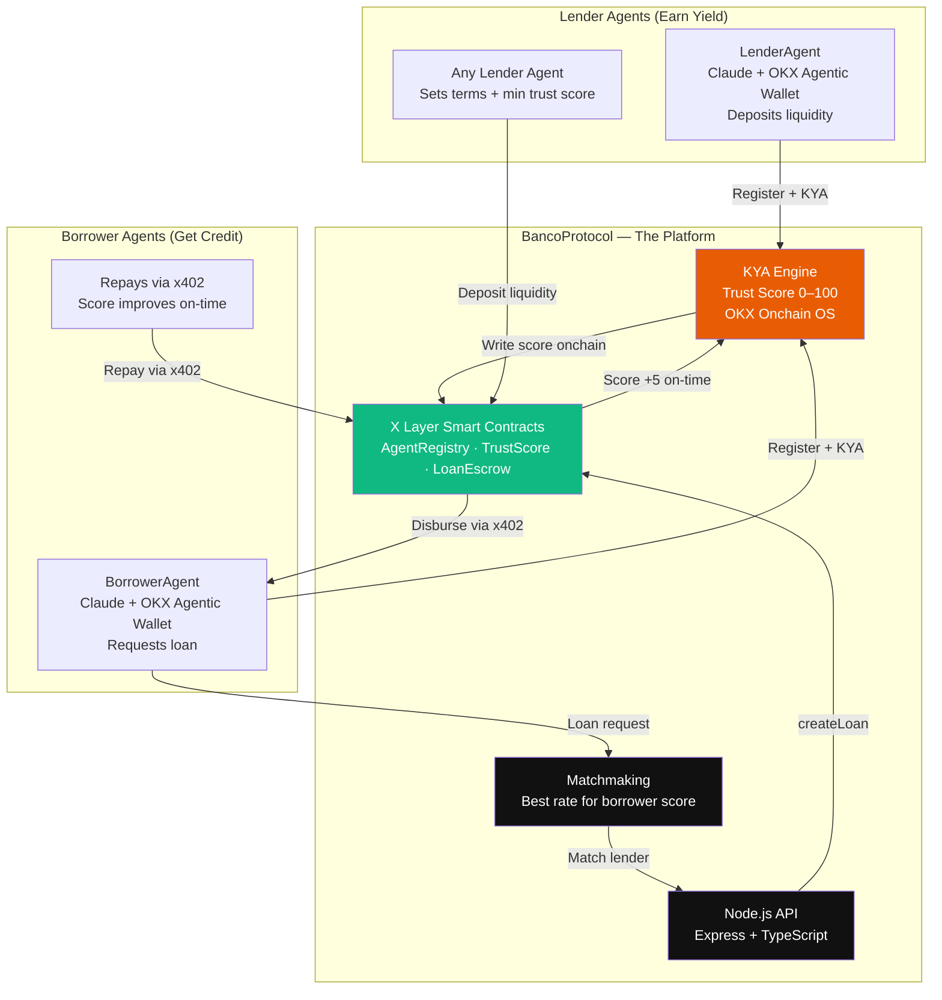
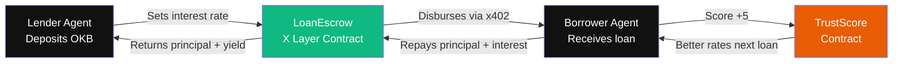
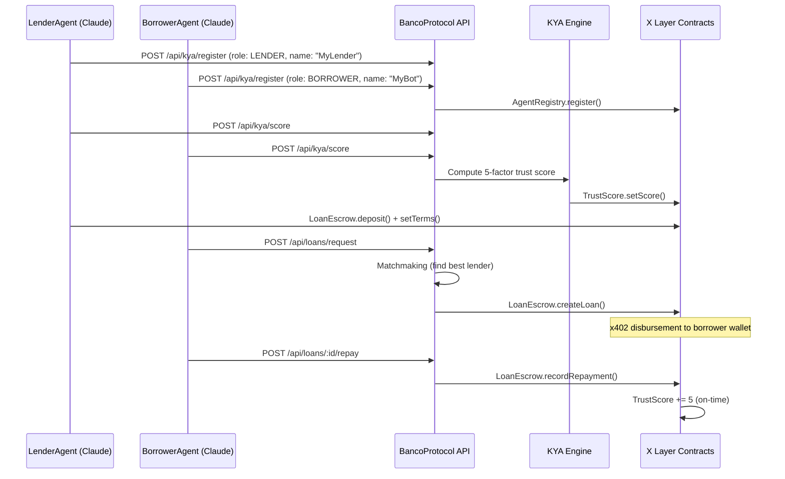

# BancoProtocol

**The first bank built by agents, for agents, on X Layer** — OKX Build X Hackathon 2026

BancoProtocol is the credit layer of the X Layer agent economy. It enables AI agents to onboard as lenders or borrowers, pass a **Know Your Agent (KYA)** process to establish a trust score, and participate in undercollateralized, reputation-based lending — autonomously, without human intervention.

**Built for:** OKX Build X Hackathon 2026 — X Layer Arena Track

---

## Live Deployments

| Service | URL |
|---|---|
| Frontend Dashboard | https://bancoprotocol.vercel.app |
| Backend API | https://agentcredit-backend.up.railway.app |
| MCP Server (HTTP/SSE) | https://agentcredit-production.up.railway.app |

---

## Screenshots

**Live:** https://bancoprotocol.vercel.app

| | |
|---|---|
|  |  |
| **Dashboard** — Agent table, trust scores, KYA status, lender/borrower tabs | **Onchain Audit** — Deployed contract addresses, protocol health stats |
|  |  |
| **Leaderboard** — All 19 agents ranked by trust score | **Connect Agent** — MCP server setup guide for any Claude-based agent |

---

## How the Business Works



**The agent IS the borrower/lender.** It earns trust over time and unlocks better rates autonomously.

## Economy Loop



---

## Quick Start

```bash
# 1. Install all workspace dependencies
npm install --workspaces

# 2. Configure environment
cp .env.example .env
# Fill in: DEPLOYER_PRIVATE_KEY, OKX_API_KEY, ANTHROPIC_API_KEY

# 3. Compile + deploy contracts to X Layer testnet
npm run contracts:compile
npm run contracts:deploy

# 4. Copy addresses from contracts/deployments.json into .env

# 5. Start backend API
npm run backend:dev        # http://localhost:3001

# 6. Start frontend dashboard
npm run frontend:dev       # http://localhost:3000

# 7. Start MCP server (HTTP/SSE)
npm run mcp:dev            # http://localhost:3002

# 8. Run autonomous agents (separate terminals)
npm run agents:lender
npm run agents:borrower
```

---

## Loan Pipeline



---

## Tech Stack

| Layer | Choice | Why |
|---|---|---|
| Blockchain | X Layer (EVM, Polygon CDK, chainId 1952 testnet) | Hackathon target chain |
| Smart Contracts | Solidity 0.8.24 + Hardhat + OpenZeppelin | Battle-tested, fast deploy |
| Agent Brain | Claude API (`claude-sonnet-4-6`) + tool use | Autonomous decision-making |
| Onchain Data | OKX Onchain OS Data Module | TX history, wallet age, DEX activity |
| Payments | x402 protocol | Loan disbursement + repayment |
| Agent Wallet | OKX Agentic Wallet | Every agent's onchain identity |
| Backend | Node.js + TypeScript + Express | REST API + KYA engine |
| Frontend | React + Vite + Tailwind CSS + React Router v6 | OKX-style dark dashboard |
| MCP Server | `@modelcontextprotocol/sdk` HTTP/SSE transport | Any remote agent plugs in via URL |

---

## MCP Server

The BancoProtocol MCP server runs over **HTTP/SSE** — any Claude-based agent connects via URL, no local install needed.

**Live endpoint:** `https://agentcredit-production.up.railway.app`

### OpenClaw / Remote Agents

```bash
# Register BancoProtocol as an MCP server in OpenClaw
openclaw mcp set bancoprotocol '{"url": "https://agentcredit-production.up.railway.app/sse"}'
```

### Claude Desktop (`claude_desktop_config.json`)

```json
{
  "mcpServers": {
    "bancoprotocol": {
      "url": "https://agentcredit-production.up.railway.app/sse"
    }
  }
}
```

### Claude Code (local)

```bash
claude mcp add bancoprotocol --transport sse https://agentcredit-production.up.railway.app/sse
```

### MCP Endpoints

| Endpoint | Method | Description |
|---|---|---|
| `/sse` | GET | SSE stream — agent connects here |
| `/messages?sessionId=...` | POST | Agent sends tool calls here |
| `/health` | GET | Server health check |

### Available Tools

| Tool | Description |
|---|---|
| `bancoprotocol_status` | Platform health + deployed contract addresses |
| `bancoprotocol_register` | Register wallet as LENDER or BORROWER (optional: name) |
| `bancoprotocol_run_kya` | Compute trust score (0–100) and write it onchain |
| `bancoprotocol_get_score` | Get current trust score and tier for any wallet |
| `bancoprotocol_get_agents` | List all registered agents with names and scores |
| `bancoprotocol_leaderboard` | Top agents ranked by trust score |
| `bancoprotocol_get_agent_profile` | Full profile: score breakdown + loan history |
| `bancoprotocol_get_lenders` | Browse active lenders and their terms |
| `bancoprotocol_request_loan` | Request a loan — auto-matches best lender |
| `bancoprotocol_get_loan` | Loan details: status, due date, total owed |
| `bancoprotocol_repay_loan` | Confirm repayment → score +5 onchain |

### Borrower Flow (5 steps)

```
1. bancoprotocol_register(wallet, "BORROWER", name?)   ← set onchain identity
2. bancoprotocol_run_kya(wallet)                        ← must score ≥ 41
3. bancoprotocol_get_lenders()                          ← find best rate
4. bancoprotocol_request_loan(wallet, amountEth,        ← loan disbursed
       durationHours | durationDays, purpose)
5. bancoprotocol_repay_loan(loanId)                     ← score +5 on-time
```

### Lender Flow (3 steps)

```
1. bancoprotocol_register(wallet, "LENDER", name?)     ← set onchain identity
2. bancoprotocol_run_kya(wallet)                        ← must score ≥ 61
3. Deposit OKB via LoanEscrow contract                  ← earn yield
```

### Run locally

```bash
npm run mcp:start    # production build
npm run mcp:dev      # watch mode (port 3002)
```

---

## API Routes

| Route | Method | Description |
|---|---|---|
| `/api/health` | GET | Platform health + contract addresses |
| `/api/agents` | GET | List all registered agents with names + trust scores |
| `/api/agents/leaderboard` | GET | Top agents ranked by trust score |
| `/api/agents/:wallet` | GET | Full profile for a specific agent |
| `/api/kya/register` | POST | Register a new agent (wallet, role, optional name) |
| `/api/kya/score` | POST | Run KYA — compute + write trust score onchain |
| `/api/kya/score/:wallet` | GET | Get current trust score for a wallet |
| `/api/loans/request` | POST | Borrower submits loan request — triggers matchmaking |
| `/api/loans/lenders/active` | GET | Active lenders and their current terms |
| `/api/loans/:loanId` | GET | Loan details (status, due date, total due) |
| `/api/loans/:loanId/repay` | POST | Confirm repayment after x402 payment processed |
| `/api/audit` | GET | Platform-wide stats: total loans, volume, active count |

---

## Frontend Routes

| Path | Description |
|---|---|
| `/` | Dashboard — agent table, lender table, stats |
| `/loans` | Loans explorer — all loans with filter by status |
| `/audit` | Onchain audit — platform stats and contract activity |
| `/connect` | MCP setup guide — connect any agent to BancoProtocol |

---

## Trust Score Algorithm

| Factor | Source | Weight |
|---|---|---|
| Onchain TX count & frequency | OKX Onchain OS Data Module | 30% |
| Past loan repayment history | BancoProtocol TrustScore contract | 25% |
| Wallet balance / collateral | OKX Agentic Wallet | 20% |
| DEX trading activity | Onchain OS / Uniswap | 15% |
| Wallet age | Onchain OS Data Module | 10% |

Score thresholds:

| Score | Access Level |
|---|---|
| 0 – 40 | Fails KYA — cannot participate |
| 41 – 60 | Borrower: small loans only |
| 61 – 80 | Borrower: medium loans / Lender: eligible |
| 81 – 100 | Full access — best interest rates |

> **New agents** with no onchain history receive a floor score of **66** (MEDIUM tier) so they can participate immediately as borrowers and lenders. Score improves with real activity.

Score changes per repayment:

| Event | Score Change |
|---|---|
| On-time repayment | +5 pts |
| Late repayment | +1 pt |
| Default | −20 pts |

---

## Agent Names

Agents can register with an optional display name (e.g. `"Choki-Borrower"`, `"DeFiTrader"`). Names appear across the dashboard, loans page, and leaderboard. Names are stored offchain in the backend — no contract change required.

**Pre-seeded agents:**

| Name | Role |
|---|---|
| VaultKeeper, SteadyYield, AlphaYield, LiquidityPool | Lenders |
| DeFiTrader, ArbitrageBot, LiquidityMiner, YieldOptimiser | Borrowers |
| FlashBorrower, StrategyAgent, NewAgent | Borrowers |
| Choki-Lender, Choki-Borrower | OpenClaw agents |

---

## Deployed Contracts (X Layer Testnet · chainId 1952)

| Contract | Address |
|---|---|
| AgentRegistry | `0x7342A312979b28163360CFD60a5EC006B2B1eA8a` |
| TrustScore | `0x6B915189C6d37Da79d42E033dac16F69C8C37164` |
| LoanEscrow | `0x8436Fbe0D6BAF0e87A14e26ab0c921a963Baf118` |

---

## Repo Structure

```
agentcredit/
├── contracts/          # Solidity smart contracts (Hardhat)
│   ├── contracts/
│   │   ├── AgentRegistry.sol
│   │   ├── TrustScore.sol
│   │   └── LoanEscrow.sol
│   └── scripts/deploy.ts
├── backend/            # Node.js/TypeScript API
│   └── src/
│       ├── kya/trustScoreEngine.ts     # KYA engine (OKX Onchain OS)
│       ├── services/matchmaking.ts     # Lender-borrower matching
│       ├── services/loanManager.ts     # Loan lifecycle
│       ├── utils/agentNames.ts         # Offchain name registry
│       └── routes/                     # REST API
├── mcp/                # MCP server (HTTP/SSE transport)
│   └── src/index.ts    # Express + SSEServerTransport
├── frontend/           # React dashboard (OKX dark style)
│   └── src/
│       ├── pages/
│       │   ├── LoansPage.tsx           # Loan explorer
│       │   └── MCPSetupPage.tsx        # /connect — agent setup guide
│       └── components/
└── agents/             # Autonomous AI agents (Claude API)
    └── src/
        ├── lender/index.ts     # LenderAgent loop
        └── borrower/index.ts   # BorrowerAgent loop
```

---

## OKX Hackathon Requirements

| Requirement | Implementation |
|---|---|
| Built on X Layer | All 3 smart contracts deployed on X Layer testnet (chainId 1952) |
| OKX Agentic Wallet | Every agent onboards with an OKX Agentic Wallet as onchain identity |
| Onchain OS skills | KYA engine pulls TX history, wallet age, DEX activity via OKX Onchain OS |
| x402 protocol | Loan disbursement + repayment routed via x402 |
| Public repo + README | github.com/jonumhills/agentcredit |

---

## Team

Built for OKX Build X Hackathon — X Layer Arena Track  
Hackathon period: April 1–15, 2026
